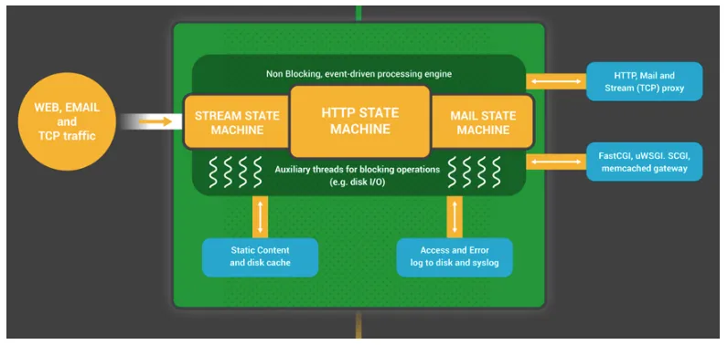
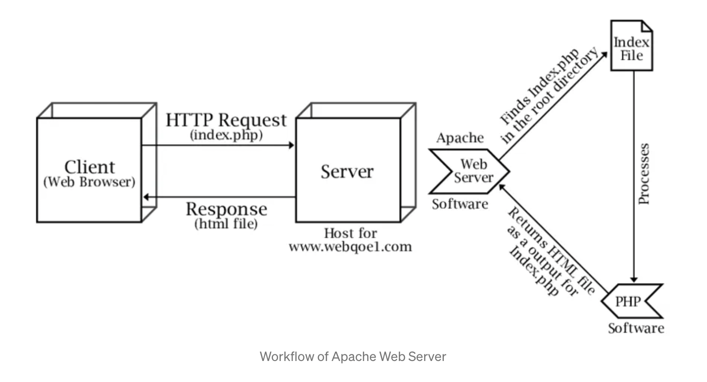

### comparation the nginx and apache
# Nginx vs Apache: Web Server Comparison

## Overview

| Feature                            | Nginx                                                   | Apache                                       |
| ---------------------------------- | ------------------------------------------------------- | -------------------------------------------- |
| **Initial Release**                | 2004                                                    | 1995                                         |
| **Architecture**                   | Event-driven, asynchronous                              | Process-driven, synchronous (with MPMs)      |
| **Performance**                    | High performance under heavy load                       | Good for moderate traffic                    |
| **Configuration Files**            | Nginx-specific syntax (`nginx.conf`)                    | `.htaccess`, `httpd.conf`, modular           |
| **Dynamic Content Handling**       | Uses FastCGI, reverse proxy to backend                  | Built-in via mod_php, mod_perl, etc.         |
| **Static Content Delivery**        | Extremely fast and efficient                            | Slightly slower due to process handling      |
| **Resource Usage**                 | Low memory, high concurrency                            | Higher memory usage with each request        |
| **OS Support**                     | Unix/Linux, Windows (limited features)                  | Unix/Linux, Windows                          |
| **Modules**                        | Not dynamically loadable (prior to 1.9.11)              | Dynamically loadable modules                 |
| **URL Rewriting**                  | Via `rewrite` directive (less flexible)                 | Very flexible with `mod_rewrite`             |
| **Popularity**                     | Widely used for high-performance sites                  | Still widely used, especially legacy systems |
| **Reverse Proxy & Load Balancing** | Built-in and powerful                                   | Requires extra modules or setup              |
| **Ease of Use**                    | Simple, clean config; less flexible                     | Rich in features, complex configs            |
| **Community & Support**            | Growing, solid docs, commercial support via Nginx, Inc. | Large, mature community and documentation    |
| **Security**                       | Very secure; minimal surface area                       | Secure, but larger codebase and more modules |

---

## architecture
### nginx

### apache

## When to Choose Nginx

- High concurrency or low memory footprint is critical
- Serving mostly static content
- Reverse proxy, caching, and load balancing needed
- Running modern, microservice or containerized apps

## When to Choose Apache

- Legacy apps or systems depend on `.htaccess` or Apache modules
- Heavy use of dynamic content generation in the server itself
- Fine-grained per-directory configurations needed
- Familiarity with Apache ecosystem

---

## Final Thoughts

Both **Nginx** and **Apache** are powerful and can be used in combination (e.g., Nginx as a reverse proxy to Apache). The best choice depends on the specific use case, performance needs, and system architecture.
